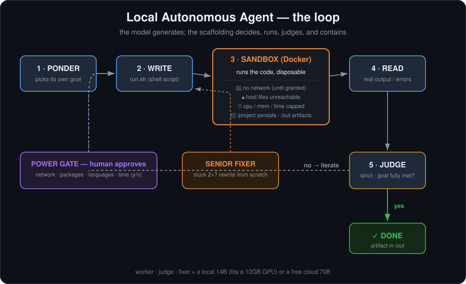

# Local Autonomous Agent — built from scratch, one lesson at a time

A DIY autonomous AI agent that **ponders its own goal, writes code (or music, stories, images, data...), runs it in a sandbox, judges its own success, and fixes its own mistakes** — driven by a *local* language model on a single consumer GPU, or a free cloud 70B.

This repo is the artifact of a single evening spent building the thing up from nothing, and it's really a story about one idea:

> **Autonomy isn't a function of what an agent is *allowed* to do — it's a function of whether it can be *trusted to judge* what to do. That trust lives in the model's intelligence, not its access.**



---

## What it does

Point it at a local model (via [Ollama](https://ollama.com)) or a free cloud model (via [Groq](https://groq.com)), and run it. It will:

1. **Ponder** and pick its own goal — anything: a game, a story, music, an image, a dataset, a tool.
2. **Write a shell script** (`run.sh`) that builds the thing, in any language it can install.
3. **Run that script inside a throwaway Docker container** — no network, no access to your files, resource-capped.
4. **Read the real output/errors** and revise — the interpreter is the teacher, not a search engine.
5. **Ask *you* for more power** (network, packages, other languages, more time) — each request pauses for your `y/n`.
6. **Judge its own success** with a strict LLM critic, and **rescue itself** with a "senior fixer" when stuck in a rut.

Everything it creates lands in `agent-workspace/output/` for you to open.

---

## The one big lesson

Building this was a repeated collision with the same truth: **the intelligence that makes an agent reliable lives in the scaffolding around the model, not the model itself.** Every failure was the harness failing to anticipate reality, or the model exercising bad *judgment* — almost never a lack of *access*.

A catalog of the failures we hit and fixed, because they're the real content:

| Failure | What actually happened | The fix |
|---|---|---|
| **Narrates instead of acts** | 7B model printed `{"name":"write",...}` as *text* instead of calling the tool | Let deterministic code do the acting; the model only generates |
| **Rumination** | Left "free," the model looped the same thought 7× | Anti-repeat rules; then a concrete goal |
| **False success** | Program caught its own error and exited 0 → harness called it "done" | Check for tracebacks, not just exit codes |
| **`input()` in a headless box** | Chose interactive designs with no keyboard → `EOFError` | Forbid stdin; drive with hardcoded/random values |
| **Timeouts dodging the rut-detector** | Infinite loops had no traceback, so repeats never accumulated | Track exit-124 as a stable "stuck" signature |
| **Confabulated power requests** | Asked for `cryptography` (for an aquarium), `nltk` (never imported) with plausible-sounding lies | Human `y/n` gate — and spot-check whether it *used* the grant |
| **Lenient self-judging** | A 14B judge passed a hardcoded 2-choice stub as a "fully interactive world" | Strict judge, low temperature, defaults to NO |
| **Over-ambitious goals** | Kept picking things it couldn't build (a full language-learning RPG) | The strict judge exposes the gap instead of papering over it |
| **CRLF / exec-bit / mount-as-directory** | Windows↔Linux plumbing hazards writing shell scripts into a Linux container | LF line endings, build binaries to `/tmp`, guard stray dirs |

None of those are "the model can't code." They're judgment, honesty, self-evaluation, and integration — and that's exactly why real agent systems lean on strong models, strict critics, and humans who check the *output*, not the agent's word.

---

## The journey (all the steps, in order)

The repo keeps the intermediate scripts in [`early-experiments/`](early-experiments/) so you can retrace it:

1. **[`1-ponder-loop.ps1`](early-experiments/1-ponder-loop.ps1)** — the naive start: let a local model "think continuously" in a loop, writing its thoughts to a journal. It rambled and repeated itself. Lesson: an LLM with no goal doesn't have deep thoughts; it loops.
2. **[`2-ponder-build.ps1`](early-experiments/2-ponder-build.ps1)** — *generate-then-commit*: the model writes prose, the **script** commits it to a file. Suddenly it actually *built* something (a document, section by section). Lesson: don't trust a small model to take actions — let it generate, let code act.
3. **[`3-code-agent-unsandboxed.ps1`](early-experiments/3-code-agent-unsandboxed.ps1)** — the write→run→read-error→fix loop, where the model debugs its own code against the real interpreter. Powerful, but running model-written code on the host is a bad idea...
4. **[`code-agent-sandboxed.ps1`](code-agent-sandboxed.ps1)** — the finished agent. Everything runs in a disposable Docker container (in WSL). Self-chosen goals, any medium, any language (installed on request), a persistent `/project` workspace, a strict judge, a rut-detector + senior-fixer, and a human approval gate for network/tools.

Along the way we also: benchmarked models to find the best one that fits a 10 GB GPU (a **14B at Q3 with a small context window hits 100% VRAM at ~53 tok/s** — faster *and* smarter than an 8B), then pointed the whole thing at a **free cloud 70B (Groq)** to prove the "smarter brain, not more access" thesis.

---

## How it works

```
ponder goal ─► (ask creator for power?) ─► write run.sh ─► run in container ─► read result
     ▲                                                                              │
     └──────────────── judge: goal met? ──── no ──── (stuck? call fixer) ◄──────────┘
                            │ yes
                           done
```

- **Worker** writes a shell script that builds the creation.
- **Sandbox**: `docker run --rm --network none --memory --cpus --pids-limit`, only `/project` (persistent) and `/out` (artifacts) writable, host untouchable.
- **Judge**: a strict LLM critic that must be *fully* satisfied — defaults to NO, rejects stubs and "related data."
- **Fixer**: when the same error repeats, a "senior engineer" pass rewrites from scratch instead of patching.
- **Power gate**: the agent starts sealed and must ask *you* to grant network / pip packages / apt tools / more time — with an explanation, approved per-request.

---

## Setup

**Requirements:** Windows + [PowerShell 7](https://github.com/PowerShell/PowerShell) (`pwsh`), [WSL2](https://learn.microsoft.com/windows/wsl/) with Docker installed inside it, and either [Ollama](https://ollama.com) (local) or a [Groq](https://console.groq.com) API key (free cloud).

```powershell
# 1. Docker inside WSL Ubuntu (one time)
wsl -d Ubuntu
  sudo apt-get update && sudo apt-get install -y docker.io
  sudo service docker start
  sudo usermod -aG docker $USER      # then reopen the WSL window
  docker run --rm hello-world        # should print "Hello from Docker!"

# 2a. Local model (Ollama):
ollama pull qwen2.5-coder:14b-instruct-q3_K_M
#     set $provider = "ollama" at the top of the script

# 2b. OR free cloud 70B (Groq):
#     get a key at https://console.groq.com, then:
setx GROQ_API_KEY "gsk_your_key_here"    # reopen the terminal after this
#     set $provider = "groq" at the top of the script

# 3. Run it (in a fresh terminal):
pwsh -NoProfile -File .\code-agent-sandboxed.ps1
```

> **Note:** the script currently uses hardcoded Windows paths under `C:\Users\Micke\goose-test\`. Adjust the `$root` / workspace paths near the top to your own location before running. (Left as-is here to faithfully document the original build.)

---

## Safety design

The **container is the safety boundary** — not any language restriction. Even at max power:
- Runs in a disposable container (`--rm`); nothing persists outside `/project` and `/out`.
- Your host filesystem is never writable beyond those two folders.
- Resource caps (`--memory`, `--cpus`, `--pids-limit`) so it can't exhaust the machine.
- Network is **off** until you grant it, per-request, with a reason you approve.

What it will still try to fool you on (and can't be fully fixed with a local model): **confabulated power requests** — it will invent plausible reasons for tools it doesn't need. The only real defense is reading each request skeptically and checking whether it actually *used* the grant.

---

## Models: what a 10 GB GPU can do

| Model | Fit on RTX 3080 (10 GB) | Speed | Notes |
|---|---|---|---|
| 8B (Q4) | 100% VRAM | ~45 tok/s | Fast, weak judgment |
| 14B (Q4) | 70% VRAM (spills to CPU) | ~13 tok/s | Too slow |
| **14B (Q3, `num_ctx=4096`)** | **100% VRAM** | **~53 tok/s** | The local sweet spot — the small context window is the trick |
| 70B | ✗ needs ~48 GB | — | Not local — but **free on [Groq](https://groq.com)** |

The 70B (via Groq's free tier) visibly picks more achievable goals, reaches for the *right* approach (e.g. writing an interactive story as an HTML file, unprompted), and is far harder to fool — the thesis, demonstrated.

---

## License

Everything in this repository from this change on is under the
[PolyForm Noncommercial License 1.0.0](LICENSE). Earlier commits stay under the terms
they were released with: the first under the MIT License, and the rest under
the Apache License 2.0 in LICENSE, although the README still said MIT. In plain terms: it is free for
any noncommercial purpose, and for schools and universities, public research
organizations, government institutions and charities, whatever their funding.
Commercial use needs a license from the author: ask through
[the issue tracker](https://github.com/MichaelFowler1/homegrown-agent/issues). Anyone who
passes on a copy has to pass on the license and the `Required Notice:` line in
[NOTICE](NOTICE). This is a plain summary; the LICENSE file is what governs.

*🤖 Built collaboratively with [Claude Code](https://claude.com/claude-code).*
